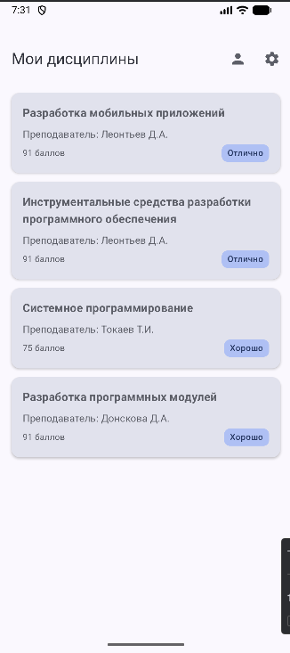
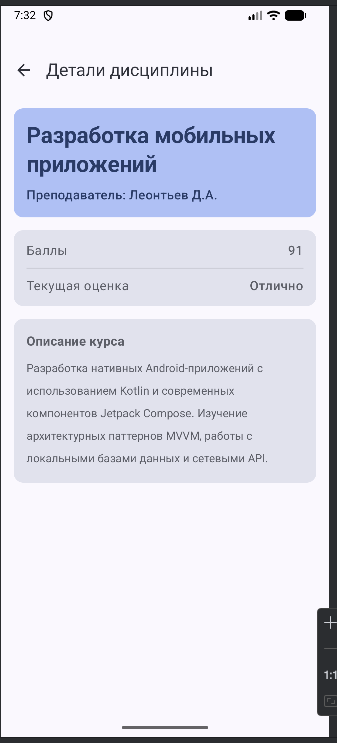
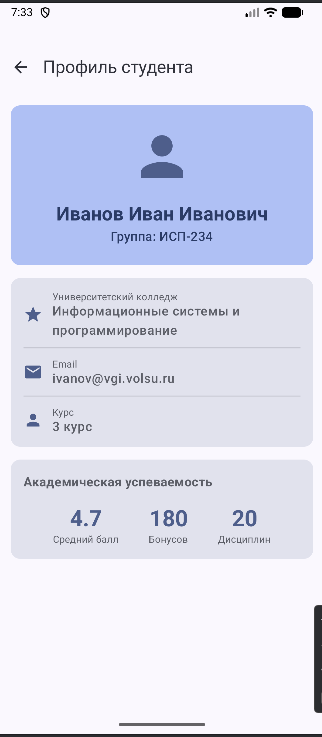
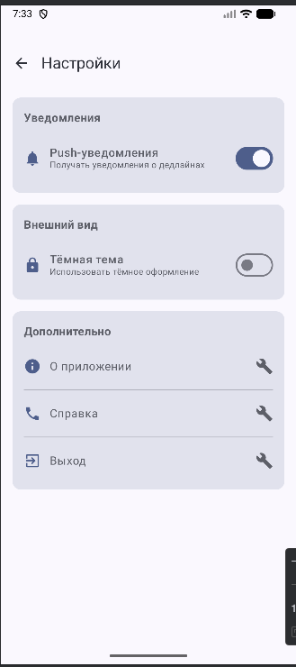
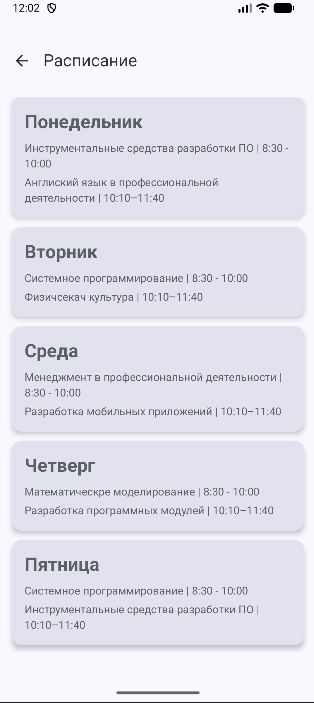

# Лабораторная работа №15-16. 

# Navigation in Jetpack Compose

#### Краткое описание приложения

Это приложение для отслеживания оценок по предметам.
В нем можно отслеживать баллы, оценку, Раписание предметов, ФИО преподавателя и само нахвание предмета.

#### Список реализованных экранов

Гланый экран: экран со списком предметов
Экран профиля: можно отслеживать настройки профиля
Экран настроек: можно отслежить настройки приложения и изменять их
Экран предмета: экран с рашриренной информацией о предмете
Экран с раписанием: можно отслеживать раписание

#### ИСпользуемые технологии: 

- Kotlin
- Jetpack Compose
- Navigation Compose - для усправления навигацией между экранами

#### Схема навигации между экранами: 
Главный экран: стартовая точка приложения. Через него можно попать на экран настроек или на экран профиля

Экран натроек: открывается по клику на инокну "Настройки". Выйти можно по клику стрелки назад

Экран профиля: открывается по клику на инокну "Профиль". Выйти можно по клику стрелки назад

Экран предмета: открывается по клику на поле с предметом, хакрывается по клику по иконке Назад

Экран раписания: открывается по клику на кнопку, закрывается по клику на кнопку Назад

#### Скриншоты основных экранов: 











#### Ответы на вопросы:

##### 1. Что такое NavController и для чего он используется?
NavController — управляет переходами между экранами, хранит стек истории (back stack), обрабатывает команды navigate() и popBackStack().

rememberNavController() создаёт экземпляр контроллера и сохраняет его состояние при рекомпозиции Compose — иначе навигация «сбрасывалась» бы при каждом обновлении UI.

##### 2. Как передать параметр в маршрут навигации?

Определение: в composable() указать параметр в маршруте ("details/{subjectId}") и описать его через arguments.
Извлечение: из backStackEntry.arguments получить значение (getString("subjectId")).

Обязательные параметры должны быть переданы — иначе ошибка. Опциональные имеют значение по умолчанию и не приводят к ошибке, если их нет.

##### 3. Зачем использовать sealed class для маршрутов?

Централизованное управление маршрутами, автодополнение в IDE, защита от опечаток, исчерпывающий контроль (например, в when).

Пример ошибки: строка "homee" вместо "home" — компилятор не заметит, а sealed class не даст использовать несуществующее значение.

##### 4. Что такое Back Stack и как им управлять?

```kotlin
[Home] → [Profile] → [Settings]  (верх стека)
```

popBackStack() на Settings: удаляется Settings, показывается Profile.

##### 5. Как работает startDestination в NavHost?

Tот, что указан в startDestination (например, Screen.Home.route).

Динамическое изменение: напрямую нельзя; можно имитировать через навигацию после старта или условную логику в NavHost.

##### 6. Что произойдёт, если навигировать на несуществующий маршрут?

navController.navigate() игнорирует вызов или бросает исключение (зависит от реализации).

Проверять существование маршрута заранее либо использовать try‑catch; в продакшене — логировать ошибку и показывать fallback‑экран.

##### 7. Зачем нужен параметр launchSingleTop в навигации?

Многократное открытие одного экрана добавляет его в стек повторно — пользователь должен нажимать «Назад» несколько раз.

Если экран уже наверху стека, launchSingleTop = true не создаёт его копию — стек остаётся без дубликатов.